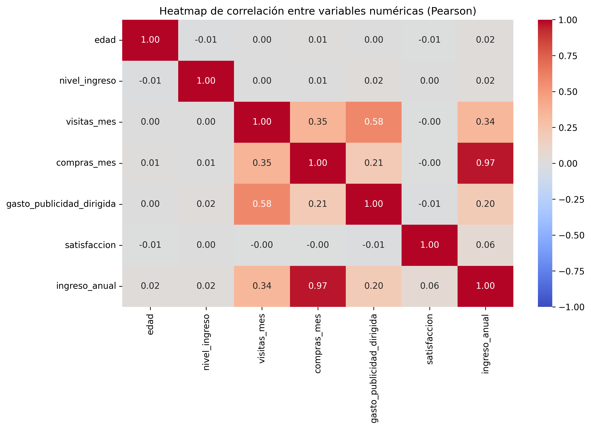
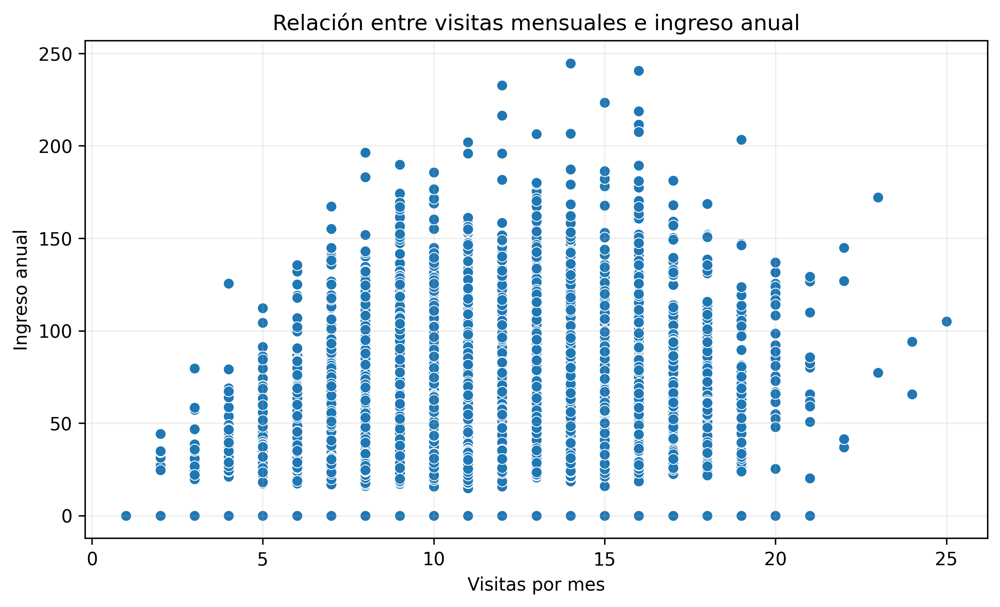
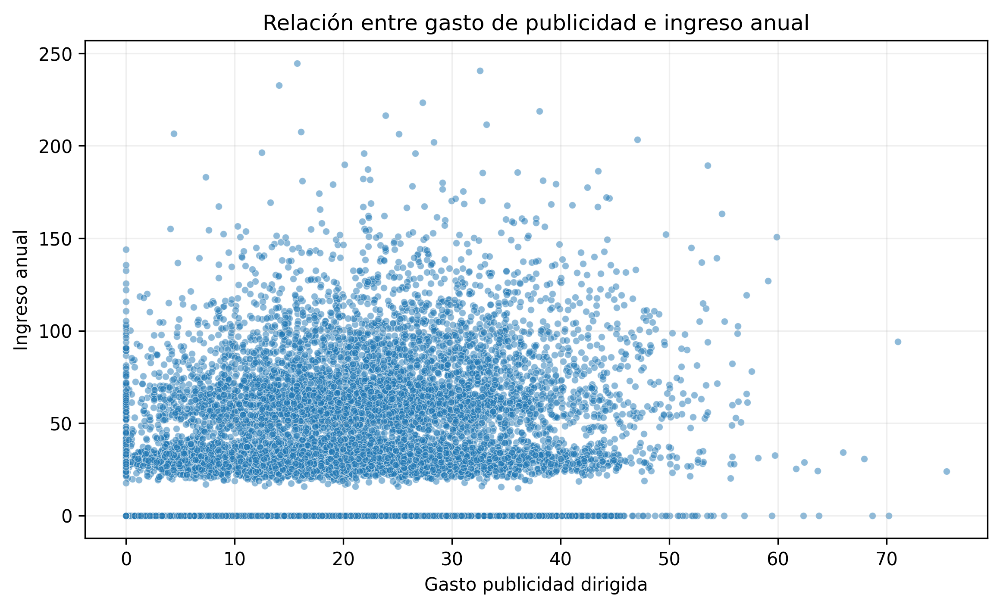

# NovaRetail Customer Correlation Analysis

## Project Overview

NovaRetail is a Latin American e-commerce platform seeking to better understand which customer behavior factors are most strongly associated with annual revenue.

The main business question is:

**Which customer behavior variables are most strongly associated with annual revenue?**

This project is an exploratory correlation analysis. The goal is to identify meaningful statistical associations that can support future segmentation, marketing analysis, and experimentation.

> Correlation does not imply causation.

---

## Business Objective

The analysis focuses on identifying which customer characteristics and behavioral variables show the strongest relationships with `ingreso_anual` (annual revenue).

Variables analyzed include:

- Monthly visits
- Monthly purchases
- Targeted advertising spend
- Premium membership
- Churn
- Age
- Income level
- Satisfaction
- Region
- Device type

---

## Methodology

Different statistical techniques were used depending on the type of variables being compared.

### Numerical Variables

- **Pearson correlation** was used to measure linear relationships.
- **Spearman correlation** was used to evaluate monotonic relationships and reduce sensitivity to extreme values.

### Numerical vs. Binary Variables

**Point-biserial correlation** was used to evaluate relationships between annual revenue and binary variables such as:

- Premium membership
- Churn

### Categorical Variables

**Cramér's V** was used to evaluate the association between categorical variables such as:

- Region
- Device type

---

## Key Visualizations

### Pearson Correlation Heatmap



The heatmap provides an overview of the relationships between numerical variables.

The strongest relationship is observed between `compras_mes` and `ingreso_anual`, with a Pearson correlation of approximately **0.97**.

However, both variables also show very similar relationships with the rest of the numerical variables, which suggests strong statistical redundancy and possible collinearity.

For this reason, monthly purchases are treated mainly as a reference variable rather than as an independent business finding.

Other relevant relationships include:

- `visitas_mes` vs. `ingreso_anual`: approximately **0.34**
- `gasto_publicidad_dirigida` vs. `ingreso_anual`: approximately **0.20**
- `visitas_mes` vs. `gasto_publicidad_dirigida`: approximately **0.58**

---

### Monthly Visits vs. Annual Revenue



Monthly visits show the most relevant behavioral association with annual revenue outside the collinear relationship with monthly purchases.

- **Pearson:** approximately **0.34**
- **Spearman:** approximately **0.32**

The relationship is positive, meaning that customers who visit the platform more frequently tend to generate higher annual revenue.

However, the considerable dispersion in the scatterplot shows that visit frequency alone does not explain customer revenue.

This variable may still be useful as a behavioral signal for identifying potentially higher-value customers.

---

### Targeted Advertising Spend vs. Annual Revenue



Targeted advertising spend presents a positive but weak relationship with annual revenue.

- **Pearson:** approximately **0.20**
- **Spearman:** approximately **0.18**

Customers associated with higher advertising spend tend to generate slightly higher annual revenue, but the relationship is limited.

This suggests that advertising effectiveness may depend on additional factors such as customer profile, visit frequency, segmentation, or campaign characteristics.

---

## Key Findings

### 1. Monthly visits are the most relevant behavioral signal associated with annual revenue

Among the behavioral variables analyzed, `visitas_mes` shows the most relevant relationship with annual revenue once the collinear relationship with monthly purchases is excluded.

The association is positive, but relatively weak.

This suggests that customers who interact with the platform more frequently may have greater commercial value, although more visits should not be interpreted as the direct cause of higher revenue.

A useful next step would be to evaluate whether specific types of visits are more likely to convert into purchases.

---

### 2. Targeted advertising shows a limited relationship with revenue

`gasto_publicidad_dirigida` has a weak positive association with annual revenue.

This means that higher advertising expenditure is not strongly associated with higher customer revenue when analyzed independently.

A more useful approach may be to evaluate advertising performance by customer segment, region, device type, or behavioral profile.

---

### 3. Monthly purchases and annual revenue show strong collinearity

The relationship between `compras_mes` and `ingreso_anual` is approximately:

- **Pearson:** 0.97
- **Spearman:** 0.97

This is the strongest relationship in the analysis.

However, the two variables also behave very similarly when compared with the rest of the dataset.

This indicates strong statistical redundancy, so monthly purchases should not be interpreted as an independent explanatory factor without additional analysis.

---

### 4. Customer profile variables show very weak associations when analyzed independently

Several profile variables show little individual association with annual revenue:

- Premium membership vs. annual revenue: **0.093**
- Churn vs. annual revenue: **-0.003**
- Region vs. device type, Cramér's V: **0.012**

These results suggest that profile variables alone may have limited explanatory power.

However, they could become more useful when combined with behavioral variables or used to build customer segments.

---

## Business Implications

The analysis suggests that behavioral variables may be more useful than profile variables when studying annual customer revenue.

Potential applications include:

- Using visit frequency as a signal to identify higher-value customers
- Measuring conversion from visits to purchases
- Evaluating advertising effectiveness by customer segment
- Combining behavioral and profile variables for richer segmentation
- Identifying customers with high engagement but low conversion
- Developing more targeted marketing strategies

---

## Limitations

The results should be interpreted with several limitations in mind:

- **Correlation does not imply causation.**
- The dataset may not include all variables that influence annual revenue.
- Most relationships were analyzed individually rather than jointly.
- Strong collinearity exists between `compras_mes` and `ingreso_anual`.
- A weak individual correlation does not necessarily mean that a variable has no business value.

Potential missing variables include:

- Average order value
- Product category
- Customer tenure
- Promotions used
- Purchase channel
- Campaign characteristics

---

## Next Steps

Future analysis could include:

- Segmenting customers based on behavior
- Analyzing visit-to-purchase conversion
- Evaluating advertising effectiveness by segment
- Incorporating additional transactional variables
- Applying multivariate statistical models
- Developing predictive models
- Designing A/B tests to evaluate causal effects

These approaches would help determine which combinations of customer characteristics provide the most useful information about revenue generation.

---

## Tools & Technologies

- Python
- Pandas
- NumPy
- Matplotlib
- Seaborn
- SciPy
- Google Colab

---

## Skills Demonstrated

This project demonstrates practical experience in:

- Exploratory Data Analysis
- Correlation Analysis
- Pearson Correlation
- Spearman Correlation
- Point-Biserial Correlation
- Cramér's V
- Data Visualization
- Collinearity Analysis
- Statistical Interpretation
- Customer Behavior Analysis
- Business Insight Generation
- Data-Driven Recommendations

---

## Repository Structure

```text
novaretail-customer-correlation-analysis/
├── README.md
├── novaretail_customer_correlation_analysis.ipynb
├── novaretail_comportamiento_clientes_2024.csv
├── pearson_correlation_heatmap.png
├── monthly_visits_vs_annual_revenue.png
└── targeted_ad_spend_vs_annual_revenue.png
